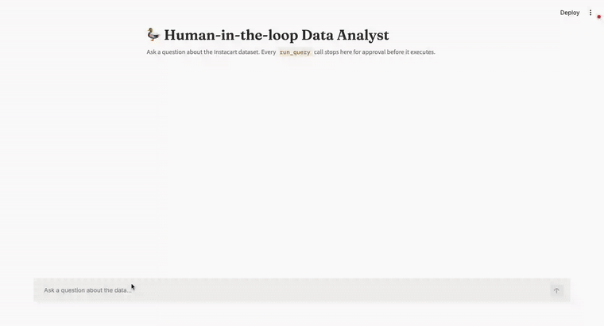

# Human-in-the-Loop Data Analyst

*Autonomous text-to-SQL agents are a liability in any real business setting: a misread question or ambiguous schema can silently return the wrong number, or execute an unintended write. This demonstrates how to keep a human in the loop as a protocol-level guarantee, not just an app-level convention, without sacrificing the speed of natural-language querying.*

A plain-English question becomes a reviewable SQL query against a real
dataset, and nothing executes until a human clicks approve.

## Problem

Text-to-SQL agents that execute automatically are a liability: a
misread question or an ambiguous schema can produce a query that
silently returns the wrong answer, or worse, one with unintended side
effects. The question this project answers: can a natural-language
question become safe, reviewable SQL with a mandatory human approval
step before anything runs, using the approval mechanism as a protocol-
level guarantee rather than an application-level convention.

## Architecture decision

Three options were considered for the approval gate:

1. **Hand-rolled**: generate SQL as plain text via a chat completion,
   display it, run it ourselves after a button click. Simple, but the
   safety guarantee lives entirely in this script; a bug in the button
   handler bypasses it silently.
2. **LangChain SQL agent**: reuses a framework already demonstrated
   elsewhere in this portfolio (the RAG project). Rejected to keep this
   project's toolset distinct and because LangChain's SQL agent doesn't
   have a first-class human-approval primitive either, so it doesn't
   solve the actual problem, just adds a dependency.
3. **MCP tool with per-tool `require_approval` (chosen)**: the DuckDB
   query capability is exposed as an MCP tool, and the OpenAI Responses
   API is configured to pause and return an `mcp_approval_request`
   before invoking specific tools. The gate is enforced by OpenAI's
   infrastructure, not by this codebase. A second, independent safety
   layer sits inside the MCP server itself: `run_query` rejects anything
   that isn't a bare `SELECT`, so even an approved-by-mistake destructive
   query can't execute.

Approval is scoped to `run_query` only, `list_tables` and
`describe_table` are set to `"never"`. Those two are read-only schema
introspection, they can't return anything beyond table and column
names, so gating them added approval clicks without adding any actual
safety. The only action that touches data, `run_query`, is the only one
a human needs to review. This was a revision after the first working
version gated every tool call, which was safer in principle but slow
enough in practice (2-3 clicks before seeing a real query) that it
worked against the demo rather than for it.

Consequence of choosing MCP: the Responses API only calls *remote*
(HTTP-reachable) MCP servers, not local stdio processes. The DuckDB MCP
server has to be running somewhere OpenAI's infrastructure can reach it,
which is why local development needs a tunnel (ngrok) and real
deployment needs the MCP server hosted separately from the Streamlit UI.

## What broke

Confirmed against a live OpenAI key, a tunneled MCP server, and the
trimmed Instacart dataset:

- The approval chain worked correctly on the first real end-to-end run.
  Multi-step tool sequences (`list_tables` to check the schema, then
  `describe_table`, then `run_query`) each triggered their own
  independent `mcp_approval_request`, confirming the gate is per tool
  call, not per conversation.
- Rejecting a proposed query does not stop the agent, it treats the
  rejection as feedback and proposes an alternative query to still
  answer the question. That regenerated query still requires its own
  separate approval, so a rejection can't be bypassed by the model
  simply retrying, it was verified that the second attempt also
  produced a fresh approval prompt.
- The `require_approval` filter and `previous_response_id` chaining
  from the design phase worked as documented, no changes needed there.
- Free-tier ngrok assigns a new URL every time the tunnel restarts.
  Since the MCP server and the tunnel are two independent long-running
  processes, killing one accidentally (e.g. running a new command in
  the same terminal tab instead of a separate one) breaks the tunnel
  silently, the ngrok tab keeps showing an old URL that no longer
  forwards anywhere. Running the MCP server, the tunnel, and Streamlit
  in three separate terminal tabs avoided this.

## Metric

Tested against 5+ distinct natural-language questions, including one
deliberate rejection to confirm that path also gates correctly. Example
result, "what are the top 5 most reordered products":

1. Banana, 7,084 reorders
2. Bag of Organic Bananas, 6,170 reorders
3. Organic Strawberries, 4,188 reorders
4. Organic Baby Spinach, 3,700 reorders
5. Organic Hass Avocado, 3,416 reorders

Zero unapproved query executions across all test runs, both the approve
and reject paths behaved correctly.

## Stack

Python, DuckDB, FastMCP, OpenAI Responses API (`gpt-4o-mini`), Streamlit.

## Running locally

1. Drop Instacart CSVs into `data/` (see `data/README.md`).
2. `pip install -r requirements.txt`
3. Terminal 1: `python mcp_server/duckdb_server.py`
4. Terminal 2: `ngrok http 8000` (or any tunnel), copy the HTTPS URL.
5. Copy `.env.example` to `.env`, fill in `OPENAI_API_KEY` and
   `MCP_SERVER_URL` (tunnel URL + `/mcp`), export both into your shell.
6. `streamlit run app.py`

## Deploying

- Streamlit app: Streamlit Community Cloud (free tier)
- MCP server: needs a host with a stable public URL. Render or Fly.io
  free tier both work; the ngrok tunnel is for local dev only and
  expires with the session.
